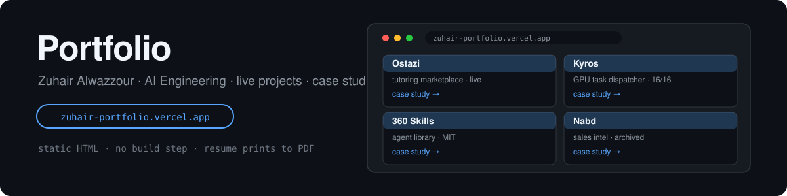

[](https://zuhair-portfolio.vercel.app)
[](index.html)

# Portfolio — Zuhair Alwazzour, AI Engineering

Personal portfolio site: hero, live projects, case studies, about, skills, contact — plus an ATS-friendly resume page that prints cleanly to PDF.

**Live:** https://zuhair-portfolio.vercel.app

## Structure

- `index.html` — home (hero, projects, about, skills, contact)
- `projects/*.html` — one case study per project
- `resume.html` — ATS-friendly resume, printable to PDF (`resume.pdf` is the export)
- `site.css` / `site-ar.css` — styles including the Arabic-RTL variant
- `site.js` — interactions, `score_carousels.py` — content scoring helper

## Local development

No build step. Serve with any static server:

```bash
python -m http.server 8080
```

Deploys to Vercel (`vercel.json` — security headers included).
